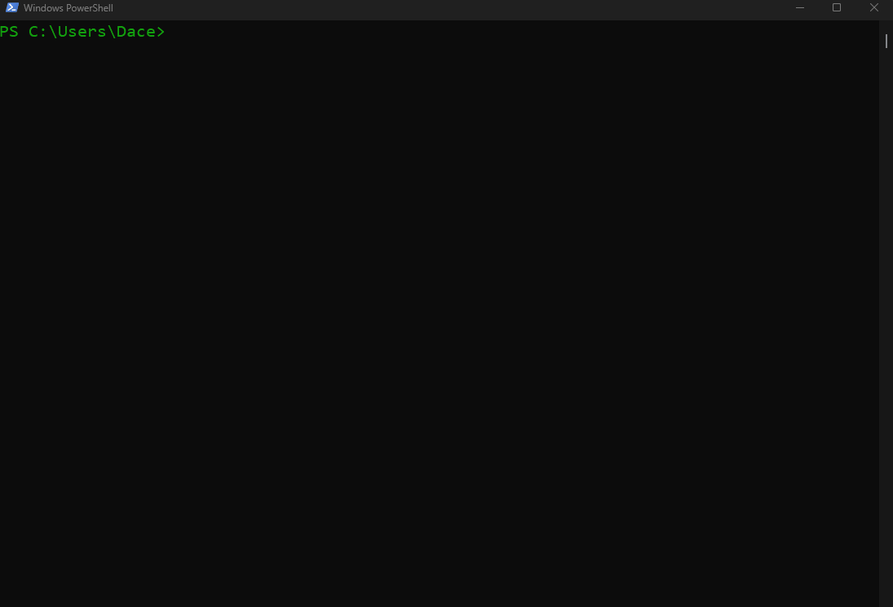
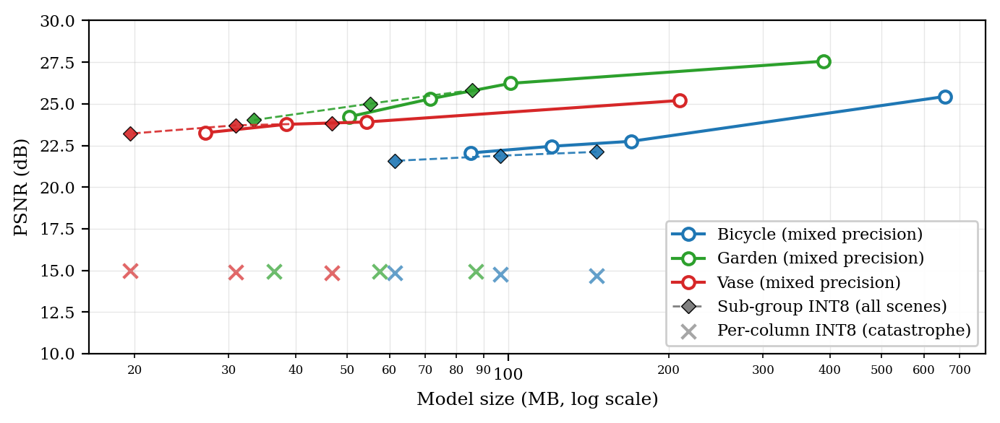
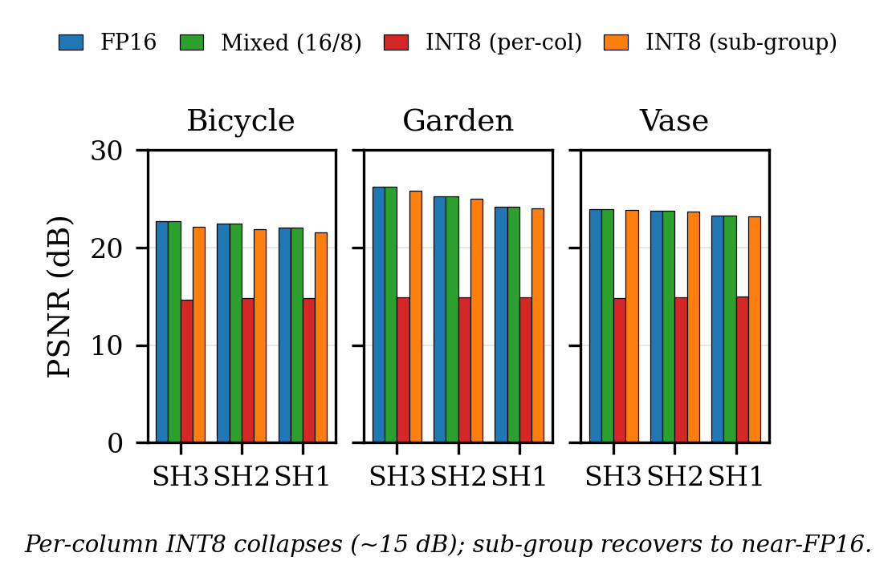

# splat-slim

**Lightweight, training-free post-processing to shrink 3D Gaussian Splatting models.**

[](https://github.com/Daceyyreal/splat-slim/releases/latest)
[](https://github.com/Daceyyreal/splat-slim/actions)


<p align="center"></p>

`splat-slim` takes a trained 3D Gaussian Splatting (3DGS) model and shrinks it
**without retraining**. It runs as a post-processing pass — prune, clean,
reduce spherical harmonics, quantize — and is framework-agnostic: it operates on
the exported `.ply`, so it works regardless of the trainer that produced it.

> Companion code for *Beyond Naive INT8: Adaptive Post-Training Compression for 3D Gaussian
> Splatting* (ICCA 2026). See [Citation](#citation).

---

## Results

One config, three scenes, a consistent ~74% size cut at modest quality cost.
Recommended operating point is **mixed precision** (FP16 geometry + INT8 appearance) at SH degree 3:

| Scene   | Size (MB)     | Size ↓ | ΔPSNR (dB) |
|---------|---------------|--------|------------|
| Garden  | 390.0 → 101.0 | 74.1%  | −1.33      |
| Bicycle | 657.0 → 170.1 | 74.1%  | −2.69      |
| Vase    | 209.4 → 54.3  | 74.1%  | −1.29      |

*Numbers from the paper: Nerfstudio `splatfacto` (30k iterations, `downscale-factor 4`), MipNeRF-360 + a
self-captured indoor scene (Vase). PSNR vs. the uncompressed baseline, measured with `ns-eval`; see
[Reproducing](#reproducing-the-paper-results) for how this CLI relates to that evaluation.*

<p align="center"></p>
<p align="center"><em>Size-quality trade-off. Solid curves = mixed precision (what the table above reports).</em></p>

Dials:
- **Conservative** — `--quant fp16` → ~55% reduction at the same quality as mixed.
- **Aggressive** — `--degree 1` → deeper cuts on scenes that tolerate it (indoor/matte > dense outdoor).
- **Smallest at near-FP16 quality** — `--quant int8-subgroup` (every field INT8, local ranges; the
  paper's best size/quality point, see below).

**Finding — why naive INT8 isn't a geometry mode:** a single global INT8 range per field
collapses geometry PSNR to ~15 dB, scene-independent. It is an artifact of the *range*, not of
8-bit storage: a few outliers stretch `[min, max]` and crush the bulk of the values onto a handful
of codes. Mixed precision avoids it by keeping geometry FP16. **Sub-group INT8** (`--quant
int8-subgroup`) avoids it differently: sort the Gaussians along a Morton (Z-order) curve, split every
field into ~1000 contiguous groups, and give each group its own `min`/`max`. Storage stays 8 bits per
value. At SH degree 3 the paper reports it recovering Garden from 14.92 to 25.82 dB, Bicycle from
14.69 to 22.11 dB and Vase from 14.85 to 23.84 dB, within 0.1-0.7 dB of FP16. See
[Sub-group INT8 format](#sub-group-int8-format).

<p align="center"></p>

<p align="center"></p>

---

## Install

Not yet on PyPI — install the latest release straight from GitHub:

```bash
pip install "git+https://github.com/Daceyyreal/splat-slim.git@v0.2.3"                      # core CLI (numpy, plyfile, typer)
pip install "splat-slim[torch] @ git+https://github.com/Daceyyreal/splat-slim.git@v0.2.3"  # + torch for tensor-based stages/metrics
```

(Drop the `@v0.2.3` to track the latest `main`.)

From source, for development:

```bash
git clone https://github.com/Daceyyreal/splat-slim
cd splat-slim
pip install -e ".[dev]"
```

## Quickstart

```bash
# Inspect a model
splat-slim info scene.ply

# Run the full pipeline
splat-slim run scene.ply slim.ply --degree 3 --quant mixed

# Sub-group INT8: writes slim.ply AND slim.meta.npz (keep them together)
splat-slim run scene.ply slim.ply --degree 3 --quant int8-subgroup
splat-slim dequantize slim.ply restored.ply          # back to a float32 PLY (Morton order)

# Or run individual stages
splat-slim prune scene.ply a.ply --percentile 5
splat-slim clean a.ply b.ply --scale-cap 1.0         # linear size; stored log-scales are capped at log(1.0) = 0
splat-slim reduce-sh b.ply c.ply --degree 2
```

`--quant` is one of `none`, `fp16`, `int8` (one range per field, the collapsing baseline), `mixed`
(default) or `int8-subgroup`; `--groups` sets the sub-group count (default 1000).

> **Changed in v0.2.0:** `--scale-cap` is now a *linear* size (default 1.0), compared against the
> stored log-scales as `log_scale <= log(scale_cap)`, the paper's cap of log 1.0 = 0. v0.1.0
> compared the log-scales with 1.0 directly. On our Garden and Bicycle PLYs this keeps the same
> Gaussians, because the 99th-percentile scale bound is already far below either value (measured
> on our Garden/Bicycle PLYs; see [`examples/verify_subgroup.md`](examples/verify_subgroup.md)).
> An unknown `--quant` value is now an error instead of silently writing an unquantized file.

## How it works

Four stages, applied in this order (paper section 3):

| Stage | What it does |
|-------|--------------|
| 1. Prune    | Drop near-transparent Gaussians below an adaptive opacity percentile. |
| 2. Clean    | Remove spatial floaters and cap over-large scales. |
| 3. Reduce SH| Lower spherical-harmonic degree (3→2→1) with channel-blocked slicing. |
| 4. Quantize | `fp16`; `mixed` (FP16 geometry + INT8 appearance); or `int8-subgroup` (INT8 with Morton-ordered local ranges). |

**Size report** (not a stage): `splat-slim info scene.ply` prints the Gaussian count, field count and
file size, and every command prints the size of its output. `splat_slim.metrics` has PSNR and
size-reduction helpers; rendering and PSNR/SSIM/LPIPS are not part of the CLI (see
[Reproducing](#reproducing-the-paper-results)).

### Sub-group INT8 format

`--quant int8-subgroup` (paper section 3.5) writes two files side by side:

- `slim.ply`: every field as `uint8`, with the Gaussians in **Morton (Z-order) order** over their
  positions (renderers sort by depth, so the stored order does not affect rendering).
- `slim.meta.npz`: the per-group ranges as a float32 table `ranges[field, group, (min, max)]`, plus
  `n`, `n_groups`, `fields` and a format `version`. Group `k` of `G` covers the sorted Gaussians
  `[floor(k*n/G), floor((k+1)*n/G))`, so the boundaries follow from `(n, G)` and are not stored.

The ranges live in a sidecar rather than in PLY header comments because 62 fields x 1000 groups
would be 62,000 comment lines (a text header of a few MB). The binary table is about 0.5 MB
(float32, before compression). The PLY header only carries informational `quant_subgroup` comments; readers find the
sidecar by name (`slim.ply` -> `slim.meta.npz`). Each value is reconstructed to within half a
quantization step of its own group's range: `(max - min) / 510`.

Decode with `splat-slim dequantize slim.ply restored.ply` or `splat_slim.io.load_subgroup("slim.ply")`.
Like the other quantized modes, these PLYs hold integer codes, so general-purpose viewers such as
SuperSplat cannot render them; `dequantize` currently covers `int8-subgroup` only.

## Reproducing the paper results

**How the paper was evaluated.** Quality numbers (PSNR, SSIM, LPIPS) were measured with Nerfstudio's
`ns-eval` on **`splatfacto` checkpoints**: each compressed model was "brain-swapped" back into a copy
of the trained checkpoint and evaluated there on held-out views (30k training iterations,
`downscale-factor 4`, one Kaggle T4). File sizes are those of the exported PLY.

**What this CLI does instead.** `splat-slim` operates on an *exported `.ply`*, not on a checkpoint, and
has no renderer. It implements the paper's four stages and gives you the compressed file and its
size. It does not compute PSNR/SSIM/LPIPS and does not include the checkpoint-injection step, so
reaching the paper's quality numbers means exporting the checkpoint to PLY, running `splat-slim`,
then injecting the result back and running `ns-eval` yourself. The install sequence, per-scene
commands and that procedure are in [`examples/reproduce.md`](examples/reproduce.md).

**What has been checked here.** On the paper's Garden scene (1,572,747 Gaussians, 390.0 MB),
`splat-slim run --degree 3` prunes with tau = 0.0138 as in the paper, keeps 1,402,751 Gaussians after
cleaning, and writes 101.0 MB with `--quant mixed` and 173.9 MB with `--quant fp16`: the sizes in the
paper's Garden table. The quality columns of that table have not been re-run through this CLI.
`examples/verify_subgroup.py` re-checks the sub-group error bound, the position-error gain and the
scale-cap behaviour on any PLY; its output for our Garden and Bicycle PLYs is in
[`examples/verify_subgroup.md`](examples/verify_subgroup.md).

## Known differences from the paper

- **Sub-group INT8 file size.** On Garden this CLI writes 87.0 MB plus a 0.43 MB sidecar
  (1,402,751 Gaussians x 62 fields x 1 byte); the paper reports 85.7 MB for `pruned_sh3_int8_subgroup`.
  The paper's plain per-column INT8 row is 87.0 MB, the size of this CLI's sub-group PLY alone.
- **Opacity in mixed mode.** `--quant mixed` stores `x, y, z`, `scale_*` and `rot_*` as FP16 and every
  other field, opacity included, as INT8. The paper's text lists opacities with the FP16 geometry,
  but its table sizes (Garden 101.0 MB = 72 bytes per Gaussian) correspond to INT8 opacity, as here.
- **Absolute scale cap.** The cap at log-scale 0 does not trigger on our Garden and Bicycle PLYs:
  the 99th-percentile log-scale is between -1.86 and -2.44 there, so the cap removes nothing on its
  own (measured on our Garden/Bicycle PLYs; see [`examples/verify_subgroup.md`](examples/verify_subgroup.md)).
  The paper reports it removing a few splats on Bicycle.
- **SH degree.** The CLI reduces to degree 1, 2 or 3. The paper also mentions degree 0 (DC term only).
- **Evaluation tooling.** There is no checkpoint-injection / `ns-eval` harness, no per-scene result
  files and no figure-generation scripts in this repository yet; only the figure images are included.

## Roadmap

- [ ] Interactive web viewer with a live size/quality slider.
- [ ] Direct nerfstudio checkpoint (`.ckpt`) input, not just `.ply`.

## Citation

```bibtex
@inproceedings{hossain2026beyondnaiveint8,
  title     = {Beyond Naive INT8: Adaptive Post-Training Compression for 3D Gaussian Splatting},
  author    = {Md. Taifur Hossain and Solaiman Sheikh Sourav and Md. Asif Hossain},
  booktitle = {Proceedings of the 4th International Conference on Computing Advancements (ICCA 2026)},
  year      = {2026},
  publisher = {ACM}
}
```

## License

MIT — see [LICENSE](LICENSE).

## Acknowledgements

Built on [Nerfstudio](https://github.com/nerfstudio-project/nerfstudio) and
[gsplat](https://github.com/nerfstudio-project/gsplat); evaluated on the
[MipNeRF-360](https://jonbarron.info/mipnerf360/) dataset.
